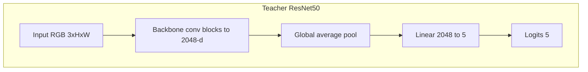
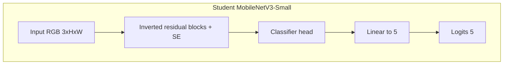
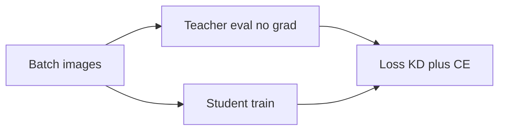

# Filipino Food Classifier (Knowledge Distillation)

PyTorch project for classifying **five Filipino dishes** using a **ResNet50 teacher** and a **MobileNetV3-Small student**, trained with **Hinton-style knowledge distillation**. Targets local training on **Intel Arc (XPU)** or CPU/CUDA via the same code paths.

## Data

### What is being classified

The model performs **5-way** image classification across these Filipino dishes:

| Dish (concept) | Example folder name in this repo |
|----------------|-------------------------------------|
| Adobo | `adobo - Google Search` |
| Kare-kare | `kare-kare - Google Search` |
| Lechon | `lechon - Google Search` |
| Sinigang | `sinigang - Google Search` |
| Sisig | `sisig - Google Search` |

Folder names are whatever `ImageFolder` uses as class labels; PyTorch assigns class indices in **lexicographic order** of folder names (see `dataset.classes` and `dataset.class_to_idx` after loading). For cleaner logs or plots, you can rename folders to short names (e.g. `adobo`, `sinigang`) as long as each class remains one directory of images.

### Layout on disk

Use **`torchvision.datasets.ImageFolder`** layout: project-relative root set by `data_root` in [`configs/default.yaml`](configs/default.yaml) (default `data/`).

```text
data/
├── adobo - Google Search/     # all images for class 0 (example)
├── kare-kare - Google Search/
├── lechon - Google Search/
├── sinigang - Google Search/
└── sisig - Google Search/
```

- **Formats:** `.jpg`, `.jpeg`, `.png`, `.webp` (and other extensions PIL can open).
- **Filenames:** Any safe filename works; long or special-character names are fine.
- **RGB handling:** Custom loader in [`src/data.py`](src/data.py) opens images with PIL, maps palette + transparency to **RGBA → RGB**, then converts other modes to **RGB** so training does not break on indexed-color PNGs.

### Scale (reference counts)

This project was developed with roughly **~470–500** images total after cleaning; one snapshot of the bundled layout was:

- Adobo: 99 · Sinigang: 99 · Lechon: 92 · Kare-kare: 92 · Sisig: 92 → **474** images.

Your counts will differ if you add/remove images. Small datasets benefit strongly from **pretrained** backbones, augmentation, and distillation—as used here.

### Train / validation split

- **Method:** **Stratified** split so each class appears proportionally in train and val (`sklearn.model_selection.train_test_split` with `stratify=targets`).
- **Ratio:** `val_ratio` in config (default **0.2** → ~80% train, ~20% val).
- **Reproducibility:** Fixed `seed` (default **42**) and a seeded `DataLoader` generator for train shuffling. The **same** split is reproduced when you re-run with the same `data_root`, `val_ratio`, and `seed`—so `evaluate.py` stays comparable to training.

With ~474 images and 20% val, expect on the order of **~380 train / ~95 val** images (exact numbers depend on rounding per class).

### Preprocessing and augmentation

Configured in YAML and applied in [`src/data.py`](src/data.py):

**Training (default):**

- `RandomResizedCrop` to `img_size` (default **256**).
- Optional **RandAugment** (`randaugment`, `randaugment_num_ops`, `randaugment_magnitude`).
- `RandomHorizontalFlip`, `ColorJitter`.
- `ToTensor`, optional **RandomErasing** on the tensor (`random_erasing_p`), then **ImageNet** `Normalize(mean, std)`.

**Validation:**

- Resize (short side), **center crop** to `img_size`, `ToTensor`, same ImageNet normalization.

No augmentation is applied at validation time, so reported **Top-1** is a standard single-crop metric.

### Adding data or classes

- **More images:** Drop files into the existing class folders; keep one dish per folder to avoid label noise.
- **New class:** Add a new subfolder under `data/`; set nothing in code if you only change the folder list—`num_classes` is inferred from `len(dataset.classes)`. You must **retrain** the teacher and student from scratch (or at least replace the final linear layers) when the number of classes changes.
- **Corrupt files:** If training crashes on a specific path, remove or re-encode that image; you can temporarily scan with a small script that runs `Image.open(...).convert("RGB")` on every file.

### Config keys (data-related)

| Key | Role |
|-----|------|
| `data_root` | Root directory for `ImageFolder` (relative to repo root). |
| `img_size` | Train crop and val crop size. |
| `val_ratio` | Fraction of each class held out for validation. |
| `seed` | Split + shuffle reproducibility. |
| `num_workers` | `DataLoader` workers (often `0` on Windows). |
| `randaugment`, `randaugment_num_ops`, `randaugment_magnitude` | Train-time RandAugment. |
| `random_erasing_p` | Probability of random erasing on train tensors. |

## Repository layout

```text
phfood/
├── configs/
│   └── default.yaml          # hyperparameters, aug, KD, checkpoints
├── data/                     # class subfolders (not committed)
├── checkpoints/              # teacher_best.pt, student_best.pt, optional *_baseline / *_high_alpha
├── src/
│   ├── data.py               # transforms, stratified train/val split
│   ├── models.py             # teacher & student builders
│   ├── losses.py             # distillation loss
│   ├── train_teacher.py      # ResNet50 training (optional two-phase)
│   ├── train_distill.py      # student + KD from frozen teacher
│   ├── train_student_baseline.py  # CE-only student -> student_baseline_best.pt
│   ├── evaluate.py           # val Top-1 for both checkpoints
│   ├── benchmark.py          # inference timing (shared core in eval_metrics)
│   ├── eval_metrics.py       # preds, confusion, per-class, inference_benchmark
│   ├── report.py             # full report + JSON/CSV export
│   └── utils.py              # config, device (xpu/cuda/cpu), aug kwargs
├── requirements.txt
└── README.md
```

## Architecture

### Teacher: ResNet50

- **Backbone:** ResNet-50 (`torchvision.models.resnet50`) with **ImageNet-1K** pretrained weights (`ResNet50_Weights.IMAGENET1K_V1`).
- **Head:** The final fully connected layer is replaced with `nn.Linear(2048, num_classes)` where `num_classes` is the number of dataset folders (5 here).
- **Training regime (default config):** Two-phase schedule—phase 1 trains only the new head while the backbone is frozen; phase 2 unfreezes the backbone and optimizes with **separate learning rates** for backbone vs. head (`teacher_optimizer_param_groups` in `src/models.py`).



### Student: MobileNetV3-Small

- **Backbone + neck:** `torchvision.models.mobilenet_v3_small` with **ImageNet-1K** weights (`MobileNet_V3_Small_Weights.IMAGENET1K_V1`).
- **Classifier:** The last linear in the classifier stack (`classifier[3]`) is replaced with `nn.Linear(in_features, num_classes)` for 5-way classification.



### Knowledge distillation (high level)

During student training, the **teacher is frozen** and produces soft targets on each batch. The student is optimized with a weighted sum of **KL divergence on temperature-scaled logits** and **cross-entropy** on hard labels (see `src/losses.py`).



## Installation

```bash
pip install -r requirements.txt
```

**Intel Arc / XPU** (recommended for this project when available):

```bash
pip install torch torchvision torchaudio --index-url https://download.pytorch.org/whl/xpu
```

Use the selector at [PyTorch Get Started](https://pytorch.org/get-started/locally/) if your platform or PyTorch version differs. Verify XPU with:

```python
import torch
print(torch.xpu.is_available())
```

## Training and evaluation

From the project root (`phfood/`):

```bash
python -m src.train_teacher
python -m src.train_distill
python -m src.evaluate
python -m src.benchmark
```

Optional: `python -m src.train_teacher --epochs N` (override epochs from YAML).

Hyperparameters, augmentation (RandAugment, Random Erasing), image size, two-phase teacher settings, distillation `temperature` / `alpha`, and checkpoint paths live in [`configs/default.yaml`](configs/default.yaml).

### Optional: second KD student (higher α)

To experiment with **more weight on the KL term** (vs cross-entropy on labels), train a separate student using `distillation_high_alpha` in config (default **α = 0.55** vs **0.28** for the main run). Weights are saved to **`checkpoints/student_high_alpha_best.pt`** and do **not** replace **`student_best.pt`**.

```bash
python -m src.train_distill --variant high_alpha
```

[`src/report.py`](src/report.py) and [`src/benchmark.py`](src/benchmark.py) pick up this checkpoint as **Student_KD_HighAlpha** when the file exists (otherwise it is skipped).

### Baseline student (no knowledge distillation)

To measure **how much KD helps**, train a second MobileNetV3-Small with **cross-entropy only** (same `student` hyperparameters and data setup as distillation). It saves to a **separate** file so your reported KD checkpoints stay untouched:

- **Output:** `checkpoints/student_baseline_best.pt` (see `checkpoints.student_baseline` in config).
- **Does not overwrite** `teacher_best.pt` or `student_best.pt`.

```bash
python -m src.train_student_baseline
```

### Full report (per-class accuracy, confusion CSV, inference time)

[`src/report.py`](src/report.py) evaluates **Teacher**, **Student_KD** (`student_best.pt`), **Student_KD_HighAlpha** (`student_high_alpha_best.pt`, if trained), and **Student_CE** (baseline, if present) on the same validation split: overall Top-1, per-class counts/accuracy, sklearn-style `classification_report` in `summary.json`, confusion matrices as CSV, and inference timing (same logic as `benchmark.py`).

```bash
python -m src.report --output-dir reports
```

Artifacts (default under `reports/`):

- `summary.json` — machine-readable metrics, timing, and per-model `flops` (thop: forward pass, batch 1, `img_size`×`img_size`); includes `kd_vs_ce` (default KD minus CE Top-1) when both exist, and **`kd_default_vs_high_alpha`** (high-α KD minus default KD Top-1) when both KD checkpoints exist. Optional model key **`Student_KD_HighAlpha`** appears after `python -m src.train_distill --variant high_alpha`.
- `confusion_<Model>.csv` — confusion matrix per model.
- `misclassified_<Model>.csv` — full path of each wrong validation image, true vs predicted class.
- `misclassified_gallery_<Model>.html` — thumbnail grid in the browser (True vs predicted labels); open the file locally after running the report.
- `per_class_long.csv` — long-format table for spreadsheets.

For a quick **latency-only** comparison (including baseline if trained), use `python -m src.benchmark`.

### Checkpoints for final reporting

Keep **`checkpoints/teacher_best.pt`** and **`checkpoints/student_best.pt`** as your frozen KD run for the write-up. **`student_high_alpha_best.pt`** is an optional extra KD experiment; **`student_baseline_best.pt`** is for the CE-only ablation. Retraining baseline or high-α student does not overwrite the default KD checkpoint.

## Results

Figures below match the committed run documented in [`reports/summary.json`](reports/summary.json). Regenerate everything with:

`python -m src.report --output-dir reports`

### Validation split (from `summary.json`)

| Field | Value |
|-------|-------|
| Validation samples | **95** (`validation.num_samples`) |
| `val_ratio` | **0.2** |
| Split `seed` | **42** |
| Classes | 5 (`class_names`: adobo, kare-kare, lechon, sinigang, sisig — full folder names in JSON) |

### Overall metrics (from `summary.json`)

| Model | Val Top-1 | Best epoch (val) | Misclassified (val) | Macro F1 | Weighted F1 | ms / image | img/s | Forward FLOPs (G) | Params |
|--------|-----------|------------------|---------------------|----------|-------------|------------|-------|-------------------|--------|
| Teacher (ResNet50) | **91.58%** | **76** | 8 | 0.9133 | 0.9148 | 46.94 | 21.30 | **5.40** | 23.52M |
| Student (**KD, α=0.28**) | **91.58%** | **28** | 8 | 0.9131 | 0.9144 | 2.18 | 459.2 | **0.080** | 1.52M |
| Student (**KD, high α=0.55**) *†* | — | — | — | — | — | — | — | **0.080** | 1.52M |
| Student (**CE-only**) | **90.53%** | **54** | 9 | 0.9014 | 0.9039 | 2.13 | 470.2 | **0.080** | 1.52M |

- **Best epoch** is the checkpoint epoch stored when that model achieved its best validation accuracy (`best_epoch` in `summary.json`).
- **Inference** uses the first validation batch; effective batch size **24** matches `teacher.batch_size_val` in [`configs/default.yaml`](configs/default.yaml).
- **Forward FLOPs** and **params** come from `models.<name>.flops` ( [**thop**](https://github.com/Lyken17/pytorch-FlopCounter): single forward on **CPU**, batch **1**, **256×256** RGB — `forward_gflops` and `num_params` in JSON). All MobileNet students share the same backbone, so FLOPs and parameter counts match; only training differs.
- *†* **High-α KD:** Train with `python -m src.train_distill --variant high_alpha`, then `python -m src.report`. Copy **Val Top-1** (`overall_accuracy`), **best epoch**, **misclassified** count, **macro/weighted F1** (`classification_report`), and **ms/img / img/s** (`inference`) from `summary.json` → **`models.Student_KD_HighAlpha`**. Until that checkpoint exists, the report skips this model and those cells stay empty here.

**KD vs CE-only** (`kd_vs_ce` in JSON): val Top-1 **+1.05 pp** (0.0105 absolute: 91.58% − 90.53%).

**KD high-α vs default KD** (`kd_default_vs_high_alpha` in JSON): printed and written when both `student_best.pt` and `student_high_alpha_best.pt` are evaluated; read `absolute_gain_high_alpha_minus_default` for Δ Top-1 (high α − default).

### Per-class validation accuracy (from `summary.json` → `per_class`)

Support = number of validation images per class (same for every model). Values are **class accuracy** (fraction correct within that class).

| Class (short) | Support | Teacher | Student KD (α=0.28) | KD high α *†* | Student CE |
|-----------------|---------|---------|----------------------|---------------|------------|
| Adobo | 20 | 100.0% | 100.0% | — | 100.0% |
| Kare-kare | 18 | 77.8% | 100.0% | — | 94.4% |
| Lechon | 18 | 88.9% | 77.8% | — | 72.2% |
| Sinigang | 20 | 95.0% | 85.0% | — | 90.0% |
| Sisig | 19 | 94.7% | 94.7% | — | 94.7% |

Use `per_class` under **`models.Student_KD_HighAlpha`** for the **KD high α** column after training (*†* same as overall table).

### Viewing misclassified images

CSV lists: [`reports/misclassified_Teacher.csv`](reports/misclassified_Teacher.csv), [`reports/misclassified_Student_KD.csv`](reports/misclassified_Student_KD.csv), [`reports/misclassified_Student_CE.csv`](reports/misclassified_Student_CE.csv). With high-α KD trained, the report also writes **`misclassified_Student_KD_HighAlpha.csv`** (and matching confusion / gallery files).

**HTML galleries** (thumbnails + true vs predicted labels):

- [`reports/misclassified_gallery_Teacher.html`](reports/misclassified_gallery_Teacher.html)
- [`reports/misclassified_gallery_Student_KD.html`](reports/misclassified_gallery_Student_KD.html)
- [`reports/misclassified_gallery_Student_KD_HighAlpha.html`](reports/misclassified_gallery_Student_KD_HighAlpha.html) (after high-α checkpoint exists)
- [`reports/misclassified_gallery_Student_CE.html`](reports/misclassified_gallery_Student_CE.html)

Open each `.html` file in your browser (double-click or “Open with”). Paths use `../data/...` relative to `reports/` so images load from the project `data/` folder. If a browser blocks local files, try another browser or open via a simple local HTTP server.

Exact numbers change if you alter the split, seed, data, or hardware; re-run `src.report` and refresh `summary.json`, CSVs, and HTML galleries together.

## License and third-party weights

Pretrained backbones are loaded from **torchvision** (ImageNet-1K). Respect the licenses of PyTorch, torchvision, and your dataset sources.
