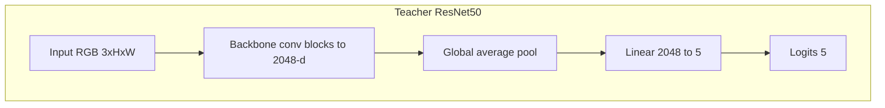
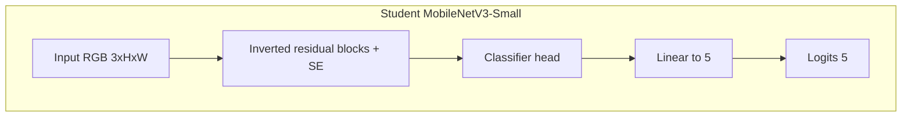
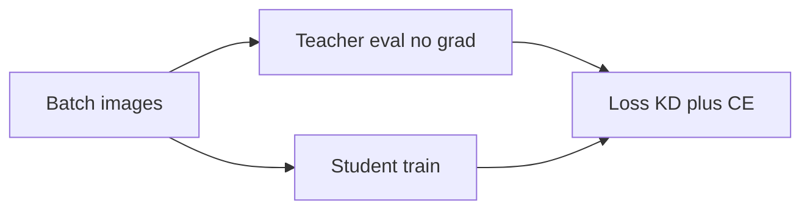

# Filipino Food Classifier (Knowledge Distillation)

PyTorch project for classifying **five Filipino dishes** using a **ResNet50 teacher** and a **MobileNetV3-Small student**, trained with **Hinton-style knowledge distillation**. Targets local training on **Intel Arc (XPU)** or CPU/CUDA via the same code paths.

## Dataset layout

Place images under `data/` using `torchvision.datasets.ImageFolder` conventions: one subfolder per class (example names from this repo):

- `adobo - Google Search`
- `kare-kare - Google Search`
- `lechon - Google Search`
- `sinigang - Google Search`
- `sisig - Google Search`

Supported extensions include `.jpg`, `.jpeg`, `.png`, and `.webp`. The loader converts palette/transparency images to RGB for stable training.

## Repository layout

```text
phfood/
├── configs/
│   └── default.yaml          # hyperparameters, aug, KD, checkpoints
├── data/                     # class subfolders (not committed)
├── checkpoints/              # teacher_best.pt, student_best.pt
├── src/
│   ├── data.py               # transforms, stratified train/val split
│   ├── models.py             # teacher & student builders
│   ├── losses.py             # distillation loss
│   ├── train_teacher.py      # ResNet50 training (optional two-phase)
│   ├── train_distill.py      # student + KD from frozen teacher
│   ├── evaluate.py           # val Top-1 for both checkpoints
│   ├── benchmark.py          # inference timing
│   └── utils.py              # config, device (xpu/cuda/cpu), aug kwargs
├── requirements.txt
└── README.md
```

## Architecture

### Teacher: ResNet50

- **Backbone:** ResNet-50 (`torchvision.models.resnet50`) with **ImageNet-1K** pretrained weights (`ResNet50_Weights.IMAGENET1K_V1`).
- **Head:** The final fully connected layer is replaced with `nn.Linear(2048, num_classes)` where `num_classes` is the number of dataset folders (5 here).
- **Training regime (default config):** Two-phase schedule—phase 1 trains only the new head while the backbone is frozen; phase 2 unfreezes the backbone and optimizes with **separate learning rates** for backbone vs. head (`teacher_optimizer_param_groups` in `src/models.py`).



### Student: MobileNetV3-Small

- **Backbone + neck:** `torchvision.models.mobilenet_v3_small` with **ImageNet-1K** weights (`MobileNet_V3_Small_Weights.IMAGENET1K_V1`).
- **Classifier:** The last linear in the classifier stack (`classifier[3]`) is replaced with `nn.Linear(in_features, num_classes)` for 5-way classification.



### Knowledge distillation (high level)

During student training, the **teacher is frozen** and produces soft targets on each batch. The student is optimized with a weighted sum of **KL divergence on temperature-scaled logits** and **cross-entropy** on hard labels (see `src/losses.py`).



## Installation

```bash
pip install -r requirements.txt
```

**Intel Arc / XPU** (recommended for this project when available):

```bash
pip install torch torchvision torchaudio --index-url https://download.pytorch.org/whl/xpu
```

Use the selector at [PyTorch Get Started](https://pytorch.org/get-started/locally/) if your platform or PyTorch version differs. Verify XPU with:

```python
import torch
print(torch.xpu.is_available())
```

## Training and evaluation

From the project root (`phfood/`):

```bash
python -m src.train_teacher
python -m src.train_distill
python -m src.evaluate
python -m src.benchmark
```

Optional: `python -m src.train_teacher --epochs N` (override epochs from YAML).

Hyperparameters, augmentation (RandAugment, Random Erasing), image size, two-phase teacher settings, distillation `temperature` / `alpha`, and checkpoint paths live in [`configs/default.yaml`](configs/default.yaml).

## Example results

On a **stratified 80/20 train/val split** with the default pipeline, a representative run reported:

| Model | Val Top-1 |
|--------|-----------|
| Teacher (ResNet50) | **91.58%** |
| Student (MobileNetV3-Small) | **91.58%** |

Exact numbers depend on split seed, hardware, and training length; the validation set is small, so metrics can vary run to run.

## Loss (reference)

Student loss:

\[
\mathcal{L} = \alpha \cdot T^2 \cdot \mathrm{KL}\big(\sigma(z_t/T)\,\|\,\sigma(z_s/T)\big) + (1-\alpha) \cdot \mathrm{CE}(y, z_s)
\]

with optional label smoothing on the CE term in code. Implementation: [`src/losses.py`](src/losses.py).

## License and third-party weights

Pretrained backbones are loaded from **torchvision** (ImageNet-1K). Respect the licenses of PyTorch, torchvision, and your dataset sources.
