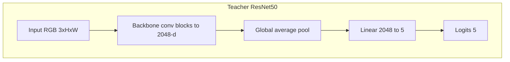
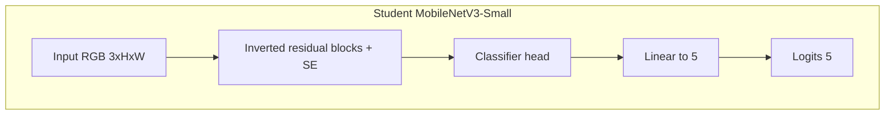
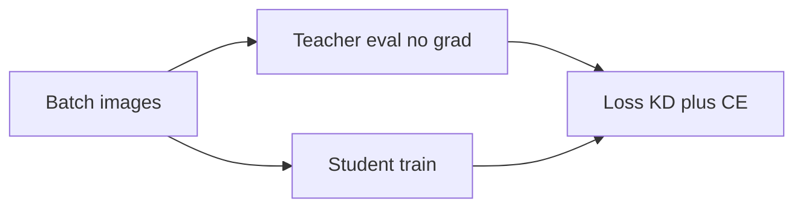

# Filipino Food Classifier (Knowledge Distillation)

PyTorch project for classifying **five Filipino dishes** using a **ResNet50 teacher** and a **MobileNetV3-Small student**, trained with **Hinton-style knowledge distillation**. Targets local training on **Intel Arc (XPU)** or CPU/CUDA via the same code paths.

## Data

### What is being classified

The model performs **5-way** image classification across these Filipino dishes:

| Dish (concept) | Example folder name in this repo |
|----------------|-------------------------------------|
| Adobo | `adobo - Google Search` |
| Kare-kare | `kare-kare - Google Search` |
| Lechon | `lechon - Google Search` |
| Sinigang | `sinigang - Google Search` |
| Sisig | `sisig - Google Search` |

Folder names are whatever `ImageFolder` uses as class labels; PyTorch assigns class indices in **lexicographic order** of folder names (see `dataset.classes` and `dataset.class_to_idx` after loading). For cleaner logs or plots, you can rename folders to short names (e.g. `adobo`, `sinigang`) as long as each class remains one directory of images.

### Layout on disk

Use **`torchvision.datasets.ImageFolder`** layout: project-relative root set by `data_root` in [`configs/default.yaml`](configs/default.yaml) (default `data/`).

```text
data/
├── adobo - Google Search/     # all images for class 0 (example)
├── kare-kare - Google Search/
├── lechon - Google Search/
├── sinigang - Google Search/
└── sisig - Google Search/
```

- **Formats:** `.jpg`, `.jpeg`, `.png`, `.webp` (and other extensions PIL can open).
- **Filenames:** Any safe filename works; long or special-character names are fine.
- **RGB handling:** Custom loader in [`src/data.py`](src/data.py) opens images with PIL, maps palette + transparency to **RGBA → RGB**, then converts other modes to **RGB** so training does not break on indexed-color PNGs.

### Scale (reference counts)

This project was developed with roughly **~470–500** images total after cleaning; one snapshot of the bundled layout was:

- Adobo: 99 · Sinigang: 99 · Lechon: 92 · Kare-kare: 92 · Sisig: 92 → **474** images.

Your counts will differ if you add/remove images. Small datasets benefit strongly from **pretrained** backbones, augmentation, and distillation—as used here.

### Train / validation split

- **Method:** **Stratified** split so each class appears proportionally in train and val (`sklearn.model_selection.train_test_split` with `stratify=targets`).
- **Ratio:** `val_ratio` in config (default **0.2** → ~80% train, ~20% val).
- **Reproducibility:** Fixed `seed` (default **42**) and a seeded `DataLoader` generator for train shuffling. The **same** split is reproduced when you re-run with the same `data_root`, `val_ratio`, and `seed`—so `evaluate.py` stays comparable to training.

With ~474 images and 20% val, expect on the order of **~380 train / ~95 val** images (exact numbers depend on rounding per class).

### Preprocessing and augmentation

Configured in YAML and applied in [`src/data.py`](src/data.py):

**Training (default):**

- `RandomResizedCrop` to `img_size` (default **256**).
- Optional **RandAugment** (`randaugment`, `randaugment_num_ops`, `randaugment_magnitude`).
- `RandomHorizontalFlip`, `ColorJitter`.
- `ToTensor`, optional **RandomErasing** on the tensor (`random_erasing_p`), then **ImageNet** `Normalize(mean, std)`.

**Validation:**

- Resize (short side), **center crop** to `img_size`, `ToTensor`, same ImageNet normalization.

No augmentation is applied at validation time, so reported **Top-1** is a standard single-crop metric.

### Adding data or classes

- **More images:** Drop files into the existing class folders; keep one dish per folder to avoid label noise.
- **New class:** Add a new subfolder under `data/`; set nothing in code if you only change the folder list—`num_classes` is inferred from `len(dataset.classes)`. You must **retrain** the teacher and student from scratch (or at least replace the final linear layers) when the number of classes changes.
- **Corrupt files:** If training crashes on a specific path, remove or re-encode that image; you can temporarily scan with a small script that runs `Image.open(...).convert("RGB")` on every file.

### Config keys (data-related)

| Key | Role |
|-----|------|
| `data_root` | Root directory for `ImageFolder` (relative to repo root). |
| `img_size` | Train crop and val crop size. |
| `val_ratio` | Fraction of each class held out for validation. |
| `seed` | Split + shuffle reproducibility. |
| `num_workers` | `DataLoader` workers (often `0` on Windows). |
| `randaugment`, `randaugment_num_ops`, `randaugment_magnitude` | Train-time RandAugment. |
| `random_erasing_p` | Probability of random erasing on train tensors. |

## Repository layout

```text
phfood/
├── configs/
│   └── default.yaml          # hyperparameters, aug, KD, checkpoints
├── data/                     # class subfolders (not committed)
├── checkpoints/              # teacher_best.pt, student_best.pt
├── src/
│   ├── data.py               # transforms, stratified train/val split
│   ├── models.py             # teacher & student builders
│   ├── losses.py             # distillation loss
│   ├── train_teacher.py      # ResNet50 training (optional two-phase)
│   ├── train_distill.py      # student + KD from frozen teacher
│   ├── evaluate.py           # val Top-1 for both checkpoints
│   ├── benchmark.py          # inference timing
│   └── utils.py              # config, device (xpu/cuda/cpu), aug kwargs
├── requirements.txt
└── README.md
```

## Architecture

### Teacher: ResNet50

- **Backbone:** ResNet-50 (`torchvision.models.resnet50`) with **ImageNet-1K** pretrained weights (`ResNet50_Weights.IMAGENET1K_V1`).
- **Head:** The final fully connected layer is replaced with `nn.Linear(2048, num_classes)` where `num_classes` is the number of dataset folders (5 here).
- **Training regime (default config):** Two-phase schedule—phase 1 trains only the new head while the backbone is frozen; phase 2 unfreezes the backbone and optimizes with **separate learning rates** for backbone vs. head (`teacher_optimizer_param_groups` in `src/models.py`).



### Student: MobileNetV3-Small

- **Backbone + neck:** `torchvision.models.mobilenet_v3_small` with **ImageNet-1K** weights (`MobileNet_V3_Small_Weights.IMAGENET1K_V1`).
- **Classifier:** The last linear in the classifier stack (`classifier[3]`) is replaced with `nn.Linear(in_features, num_classes)` for 5-way classification.



### Knowledge distillation (high level)

During student training, the **teacher is frozen** and produces soft targets on each batch. The student is optimized with a weighted sum of **KL divergence on temperature-scaled logits** and **cross-entropy** on hard labels (see `src/losses.py`).



## Installation

```bash
pip install -r requirements.txt
```

**Intel Arc / XPU** (recommended for this project when available):

```bash
pip install torch torchvision torchaudio --index-url https://download.pytorch.org/whl/xpu
```

Use the selector at [PyTorch Get Started](https://pytorch.org/get-started/locally/) if your platform or PyTorch version differs. Verify XPU with:

```python
import torch
print(torch.xpu.is_available())
```

## Training and evaluation

From the project root (`phfood/`):

```bash
python -m src.train_teacher
python -m src.train_distill
python -m src.evaluate
python -m src.benchmark
```

Optional: `python -m src.train_teacher --epochs N` (override epochs from YAML).

Hyperparameters, augmentation (RandAugment, Random Erasing), image size, two-phase teacher settings, distillation `temperature` / `alpha`, and checkpoint paths live in [`configs/default.yaml`](configs/default.yaml).

## Example results

On a **stratified 80/20 train/val split** with the default pipeline, a representative run reported:

| Model | Val Top-1 |
|--------|-----------|
| Teacher (ResNet50) | **91.58%** |
| Student (MobileNetV3-Small) | **91.58%** |

Exact numbers depend on split seed, hardware, and training length; the validation set is small, so metrics can vary run to run.

## License and third-party weights

Pretrained backbones are loaded from **torchvision** (ImageNet-1K). Respect the licenses of PyTorch, torchvision, and your dataset sources.
